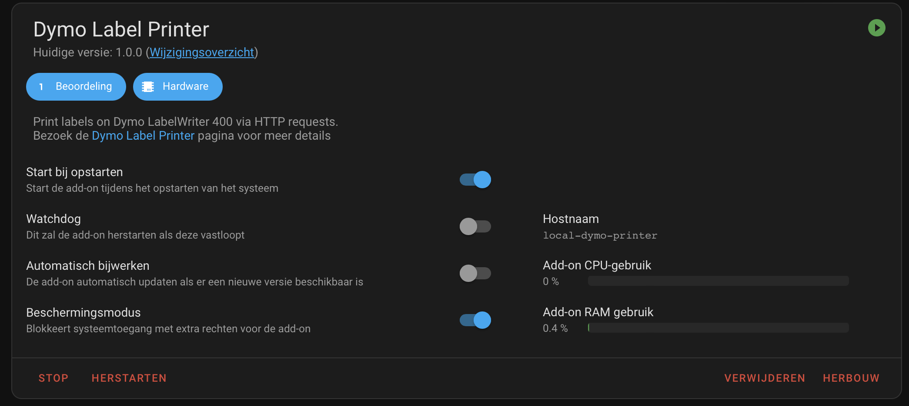
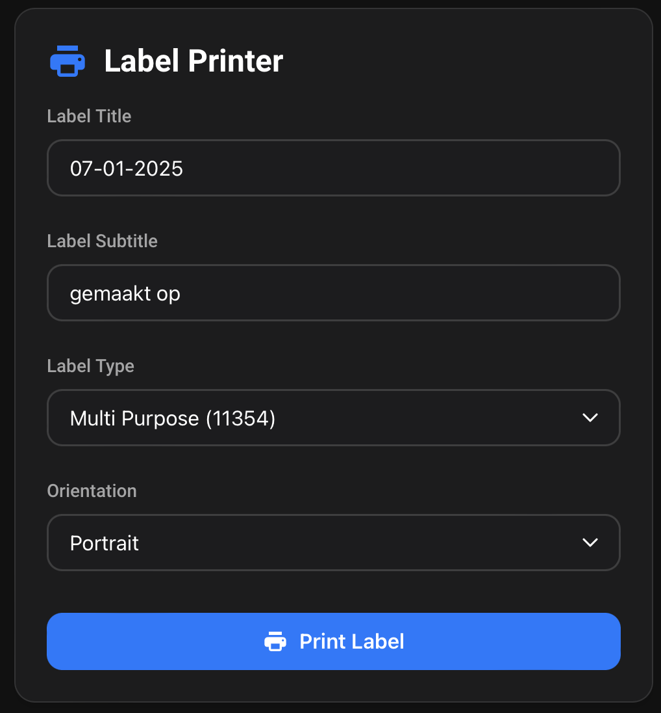

# Home Assistant Dymo LabelWriter Integration

Print labels directly from your Home Assistant dashboard using a Dymo LabelWriter 400. This integration includes both a Home Assistant add-on and a custom Lovelace card for a seamless label printing experience.



## Features

- Simple and intuitive Lovelace card interface
- Support for multiple label types (99010, 11354)
- Portrait and landscape orientation options
- Automatic date insertion
- Dark mode support
- Responsive design
- Direct USB printer connection

## Installation

### Step 1: Install the Add-on

1. Navigate to your Home Assistant's Supervisor panel
2. Click on the Add-on Store
3. Click the three dots in the top right and select "Repositories"
4. Add this repository URL
5. Find the "Dymo Label Printer" add-on and click install



### Step 2: Configure the Add-on

1. After installation, go to the add-on's Configuration tab
2. Start the add-on
3. Enable "Start on boot" if desired
4. Enable "Watchdog" for automatic recovery

### Step 3: Configure Home Assistant

1. Add the following to your `configuration.yaml`:
```yaml
rest_command:
  print_label:
    url: "http://localhost:8000/print_label"
    method: POST
    content_type: "application/json"
    payload: '{"title": "{{ title }}", "subtitle": "{{ subtitle }}", "label_type": "{{ label_type }}", "orientation": "{{ orientation }}"}'

frontend:
  extra_module_url:
    - /local/label-printer-card.js
```

2. Restart Home Assistant to apply the configuration changes

### Step 4: Add the Lovelace Card

1. Copy the `label-printer-card.js` file to your `www` folder in Home Assistant
2. Add the card to your dashboard:
```yaml
type: 'custom:label-printer-card'
entity: sensor.dymo_printer # can be a random entity as lovelace requires this
```

## Supported Label Types

- **Standard Address (99010)**: 89mm x 28mm
- **Multi Purpose (11354)**: 57mm x 32mm

## Usage

1. Select your desired label type from the dropdown
2. Choose the orientation (portrait/landscape)
3. Enter your label title (defaults to current date)
4. Enter your subtitle (defaults to "gemaakt op")
5. Click "Print Label"

## Technical Details

The add-on runs a CUPS print server and Flask web application that:
- Automatically detects your Dymo LabelWriter
- Handles label generation with proper dimensions
- Manages print jobs
- Provides a REST API endpoint for label printing

## Requirements

- Home Assistant Supervisor
- Dymo LabelWriter 400 connected via USB
- USB port access on your Home Assistant host

## Service Calls

You can print labels by calling the `rest_command.print_label` service in Home Assistant:

```yaml
service: rest_command.print_label
data:
  title: "My Label"
  subtitle: "Custom subtitle"
  label_type: "multi_purpose"
  orientation: "portrait"
```

This can be used in automations, scripts, or called directly through the Developer Tools.

## Troubleshooting

1. **Printer not detected:**
    - Check USB connection
    - Verify USB device permissions
    - Check add-on logs for detection messages

2. **Print quality issues:**
    - Clean printer head
    - Verify genuine Dymo labels are being used
    - Check label type selection matches physical label

3. **Card not loading:**
    - Verify resource path in Lovelace configuration
    - Check browser console for JavaScript errors
    - Confirm Home Assistant is running latest version

## Contributing

Contributions are welcome! Please feel free to submit a Pull Request.

## License

This project is licensed under the MIT License - see the LICENSE file for details.

## Acknowledgments

- Thanks to the Home Assistant community
- Dymo for printer specifications
- All contributors and testers

## Support

If you encounter any issues or have questions:
1. Check the troubleshooting section
2. Review add-on logs
3. Open an issue on GitHub with:
    - Home Assistant version
    - Add-on version
    - Relevant logs
    - Steps to reproduce